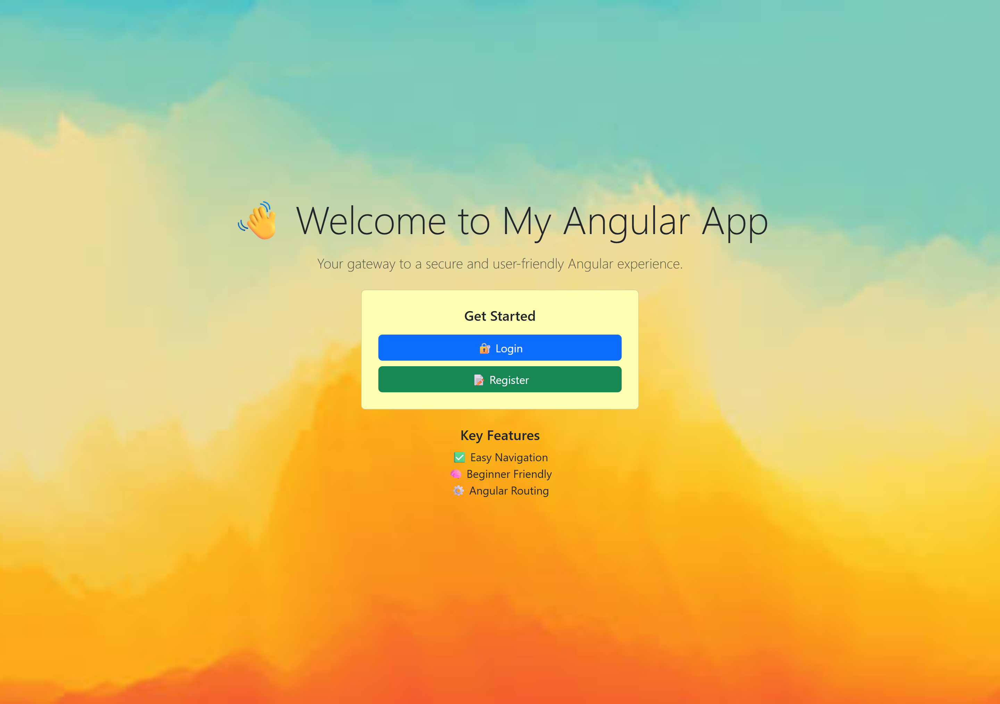
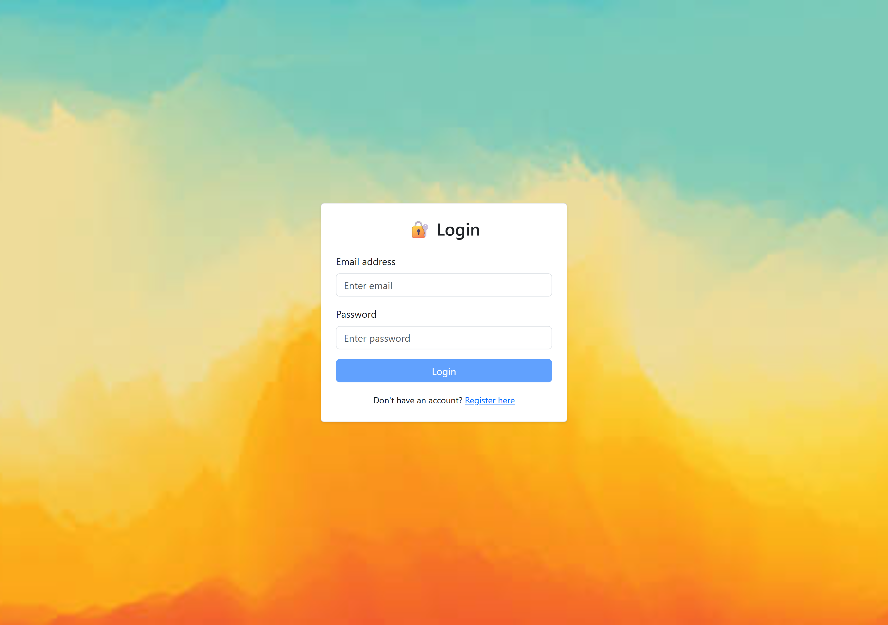
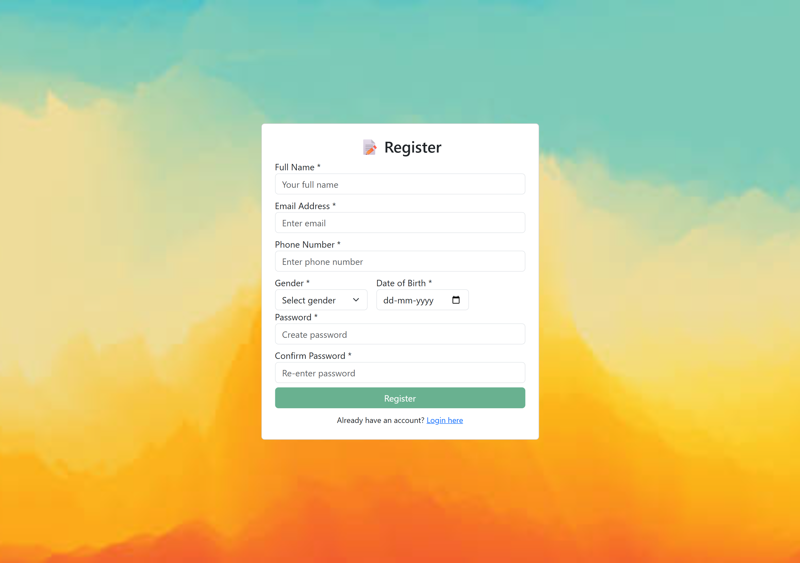

# User Validation Form

A simple user validation form using Angular.
=====================================
### Features
- Easy Navigation
- Beginner Friendly
- Angular Routing
- User input validation
- Error messages display
- Form submission handling

## Overview
### screenshots

- Home

- Login

- Register

